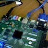
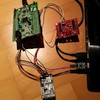

Hello!  
This site contains my projects:
* 2016
 * [ RPi Vibration Measurement (W.I.P.)](https://loruro.github.io/RPi_Vibration_Measurement/)
 * [ Zynq FPGA - Median Filter](https://loruro.github.io/Zynq_FPGA_Median_Filter/)
 * [ Barometer - STM32](https://loruro.github.io/Barometer_STM32/)
* 2015
 * [ Ultrasonic Anemometer](http://loruro.github.io/Ultrasonic_Anemometer/)
 * [ Obstacle Avoiding Robot - RoboCORE](http://loruro.github.io/Obstacle_Avoiding_Robot---RoboCORE/)
* 2013
 * [ 2D Nbody Gravity Simulator](http://loruro.github.io/2D_Nbody_Gravity_Simulator/)